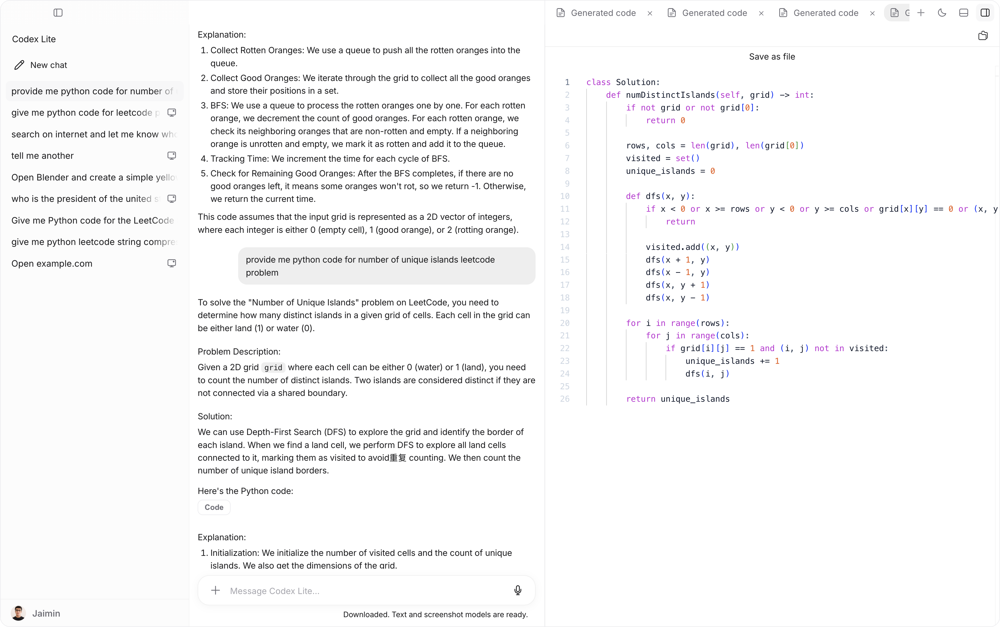
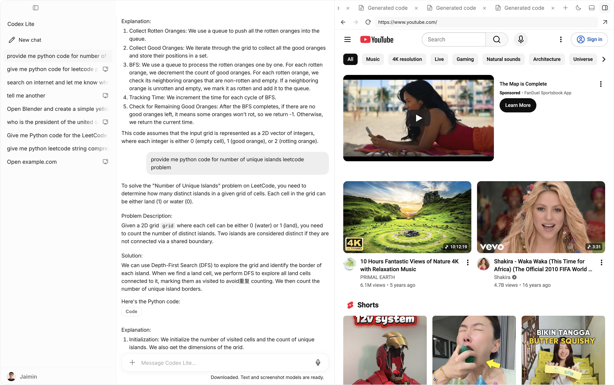
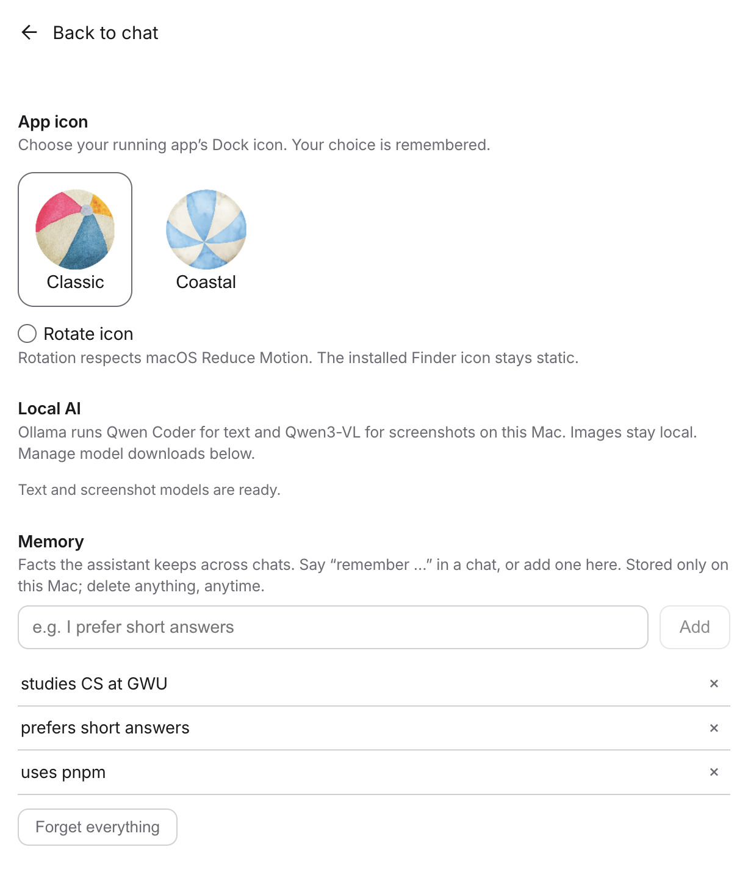
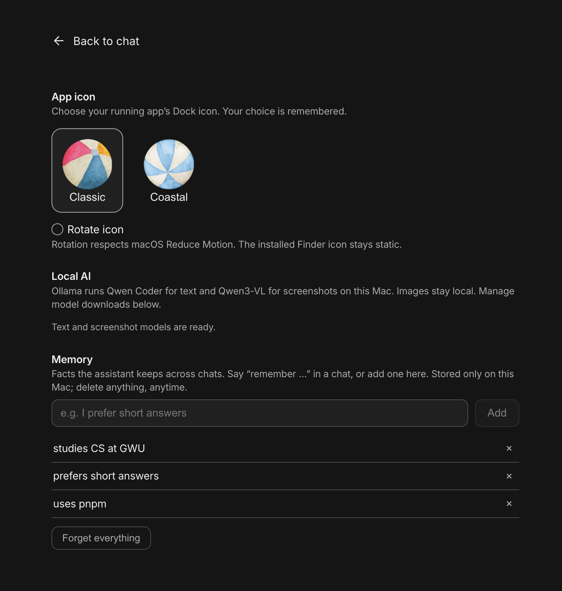

# Codex Lite

No, this is not Codex. This is Codex Lite.

I built a macOS app that puts AI chat, your code, and a browser next to each other. Ask a question, open a file, look something up, or attach a screenshot without constantly switching windows.

This is my independent portfolio project, not an OpenAI product. It does not include a Codex or ChatGPT subscription.



## Take a look

### Watch it in action

https://github.com/user-attachments/assets/fc467068-9110-4891-8230-75624e7107e2

https://github.com/user-attachments/assets/4fe209dc-64e8-4652-8853-ea172575e1f9

The right panel can hold your code editor, files, terminal, review, and browser tabs. The chat stays beside them.



### Settings in light and dark mode

Choose a Classic or Coastal ball, optionally rotate the Dock icon, manage local model downloads, and edit what the assistant remembers.





These are development screenshots recorded on September 13, 2026. They show the interface, not a benchmark of answer or code correctness.

## What I built

- Local text and code answers with Qwen Coder through Ollama.
- Local screenshot understanding with Qwen3-VL. Capture a region with Cmd+Shift+D or attach an image.
- Internet search with a visible Searching status. Google is tried first, with DuckDuckGo as a fallback. Search reads page text without vision calls.
- A tabbed workspace with Monaco syntax highlighting, a right-side file tree, breadcrumbs, file icons, autosave, and compact scrollbars.
- An embedded browser with its own navigation bar, plus terminal and code-review panels.
- Saved chats and editable local memory.
- Local Whisper dictation, image and document attachments, and video-frame input.
- GitHub sign-in and a hosted Go backend connected to PostgreSQL.
- A Stripe sandbox subscription demo that exercises checkout and access activation without a real payment.
- Light and dark themes, compact controls, and the rolling ball response animation.

## The payment is a demo

The hosted demo uses Stripe sandbox. The displayed $1/month is a simulated subscription, not a charge to your bank account.

Only on a checkout clearly marked as a sandbox or demo, use card `4242 4242 4242 4242`, a future expiry, and any three-digit CVC. Never enter a real card for this demo.

GitHub sign-in and sandbox checkout have been tested against the hosted backend. This is separate from AI quality testing.

## What runs where?

```text
Your Mac
  Electron + React
    |-- chats, memory, files
    |-- Ollama -> Qwen text / screenshot models
    |-- isolated browser -> Google / DuckDuckGo
    |
    +-- HTTPS -> Go backend on Render
                    |-- GitHub OAuth
                    |-- PostgreSQL on Supabase
                    +-- Stripe sandbox + signed webhooks
```

The Go server handles identity and subscription state. It is not the machine running the local Qwen models. The desktop app never needs the database password, Stripe secret key, or GitHub client secret.

## Things I am still improving

This is a working prototype, not a replacement for a production coding assistant.

Small local models can misunderstand questions or produce incorrect code. Search currently supplies snippets rather than full articles. A sourced response is not automatically a correct response. The answer pipeline retries a plan-only or unsourced response once, then offers source links if it cannot produce a usable answer.

Search answers prefer the installed Qwen3 model when ready. Ordinary text and code chat stay on Qwen Coder.

Visual computer automation remains experimental and has separate capability checks. Screenshot understanding does not mean every desktop task is supported.

Initial model setup needs several gigabytes of downloads and disk space. Text chat can become available before the screenshot model finishes. Hosted services can sleep or become unavailable; free hosting allowances are not an uptime guarantee.

## Run it locally

Use macOS and a supported Node.js release for Vite 7, such as Node 22.12 or newer in the Node 22 line.

```bash
git clone https://github.com/jaiminjariwala/Codex_Lite.git
cd Codex_Lite
npm install
npm run dev
```

Set `MANAGED_BACKEND_URL` in your ignored `.env.local` to the intended backend before building. The default app flow needs a working account backend. See [setup](docs/SETUP.md) for the full checklist.

```bash
npm run typecheck
npm test
npm run build
```

Source changes do not automatically update a previously downloaded DMG. Packaging and signing are covered in [development](docs/DEVELOPMENT.md).

## Under the hood

Electron, React, TypeScript, Monaco, Ollama, Qwen, Go, PostgreSQL, GitHub OAuth, and Stripe.

- [Architecture and data flows](docs/ARCHITECTURE.md)
- [How it works in plain language](docs/HOW-IT-WORKS.md)
- [Backend and sandbox setup](docs/BACKEND.md)
- [Local setup](docs/SETUP.md)
- [Current feature inventory](docs/FEATURES.md)
- [Technology choices](docs/TECH-STACK.md)
- [Development and packaging](docs/DEVELOPMENT.md)
- [Safety](docs/SAFETY.md)

Built by Jaimin Jariwala.
